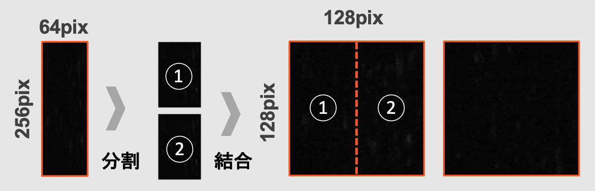

# image processing libraly

いろいろな画像処理を行うディレクトリ


# Gneral specification
* 読み込み可能な画像の拡張子はopencvに準拠．
* 保存時の拡張子は，`.jpg`
* 保存先のディレクトリが存在しない場合，自動的にディレクトリが作成される．
* すでに存在するディレクトリを指定した場合は，上書きされる．
* argments のhelpを見れば機能と指定を見れる↓
```
python3 src/img_aug_ver2.0.py --h
```

# Usage
##  ``img_aug_ver2.0.py``
* 画像の高さと幅のピクセル値を指定したリサイズ↓
```bash
python3 src/img_aug_ver2.0.py --inpt_dir "{your input directory}" --output_dir "{your output directry}" --resize_pixel  128 256
```
input_dir で指定したディレクトリ内の画像を読み込み，
height 128 ，width 256にリサイズ．
output_dir で指定したディレクトリ画像を保存する．


* 元画像に対する比率を用いたリサイズ↓
```bash
python3 src/img_aug_ver2.0.py --inpt_dir "{your input directory}" --output_dir "{your output directry}" --resize_scale  0.5
```
`--resize_scale`は，1.0以下のfloatで指定すること．
リサイズ後の値が浮動小数点の場合，intでcastしているため，切り上げ．


* 元画像から，指定された画像サイズで切り出し↓
```bash
python3 src/img_aug_ver2.0.py --inpt_dir "{your input directory}" --output_dir "{your output directry}" --split_size　128 64
```
height->128,width->64で切り出しを行う．
指定した画像サイズで，切り代やあまりなく，元画像をすべて切り出しできるように，
元画像は予めリサイズを行っている．

* input_dir  内の画像の枚数を削減する↓
```bash
python3 src/img_aug_ver2.0.py --inpt_dir "{your input directory}" --output_dir "{your output directry}" --data_reduction 0.5
```
input_dir内の画像枚数が100枚の場合，
100*0.5=50枚の画像をoutput_dirで指定したディレクトリにコピーする．
argment type は1.0 以下の`float`

* 画像の横方向結合↓
```bash
python3 src/img_aug_ver2.0.py --inpt_dir "{your input directory}" --output_dir "{your output directry}" --data_concat
```
画像をheight/2で上下に分割し，左右に結合する．



その他の機能は未実装．
##  ``img_aug_ver2.0.py``

* マウス操作で，画像内から指定サイズを切り出す↓
```bash
python3 imgtrim_gui_ver.2.0.py  --input_dir "{your input directory}"--output_dir "{your output directory}"  --trim_width 32 --trim_height 64
```
input_dir に存在する画像を読み込み，画像内の任意の場所でマウスのMBUTTONを押すと，trim_width,trim_heightで切り出し，output_dir に保存．
次の画像へ遷移するには，LBUTTON．終了は，RBUTTON
ログ機能等は実装していないので．
毎回，最初の画像から，読み込みが行われる．
画像処理で，データセット作れないときの最終手段.....
もしくは，とりあえず，データセット作りたいのときの，プリデータセット作成とかで使う．
# Requirement
 
* Ubuntu 18.04 LTS later
* python 3.6.9
* matplotlib 3.2.2
* opencv 4.4.0


# Author
* haxhimitu
* National institute of sasebo calleage
* it1915[@]st.sasebo.ac.jp
* haxhimitsu.lab[@]gmail.com
 
